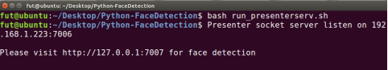
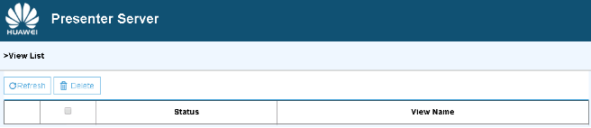
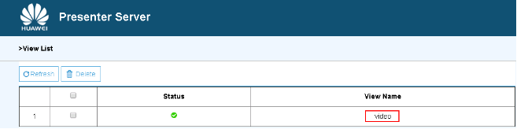

EN|[CN](README_cn.md)

Developers can deploy the application on the Atlas 200 DK to collect camera data in real time and predict facial information in the video.
Note:uihost refers to the Ubuntu PC server; host refers to altas200dk development board; device refers to ascend310 chip

## Prerequisites

Before using an open source application, ensure that:

-   The Atlas 200 DK developer board version must be 887 at least 
-   The board should connect camra with CAMERA0
-   Login the development board through the Ubuntu server SSH is avaliable
-   The Atlas 200 DK developer board complete the necessary configuration of Python environment and system

## Enviroment Configuration
-  Get Code  

Download all the code in the sample-objectdetection repository at https://github.com/shanchenqi/object_detection   to any directory on Ubuntu PC Server, for example,  _/home/ascend/sample-objectdetection/_.

-  Install dependency

	Switch to root user,enter the directory sample-objectdetection-python/script，excute the following command:

	bash install.sh board-ip internet-ip usb-network-ip
	
	board-ip: the developer board ip. The default ip is 192.168.1.2 when connect with usb
	
	internet-ip: the Ubuntu PC server ip that link to internet
	
	usb-network-ip: the Ubuntu PC server ip that link to developer board
	
	The install.sh script performs the following operations:
	
	1.Install the python package dependency of the presenter server
	
	2.Configure the developer board and Ubuntu pc server network so that the developer board can connect to the Internet. Both the Ubuntu pc server and the developer board network configuration need to be executed as root user, so you need to switch to the root account on the Ubuntu pc server to execute the install.sh script. In addition, the install.sh script on the developer board will also switch to the root account to execute the configuration command. When switching, the user will be prompted to enter the root account password of the developer board. The default password is "mind @ 123";
	
	3.Upgrade and update the Linux system of the developer board. In order to install the Python package dependency in developer board, the install.sh script will automatically execute the commands "apt-get update" and "apt-get upgrade" on the development board. According to the status of the network and the developer board, such as whether the update has been executed, the execution time of this step may exceed 20 minutes. During the installation, if arise query or interact, select y or default
	
	4.Install the model inference Python package hiai, and it's Python packages dependency such as Python-dev, numpy, Pip, esasy_install, enum34, funcsigns, future. Because numpy is compiled and installed in a long time, the installation time will be more than 10 minutes. During the installation process, there will be installation query interaction. Enter y
	
	Note: the installation environment only needs to be executed in the following two scenarios: 
	
	(1) Running the object detection sample for the first time; 
	
	(2) Running the object detection sample after upgrading the developer board with make startup card afresh.
	
	You do not need to perform after a successful installation
  

## Deployment
	
-   Step 1 Switch to normal user,enter to the directory sample-objectdetection-python/script，excute the following commands:

	bash deploy.sh board-ip usb-network-ip 
	
	board-ip: the developer board ip that link to Ubuntu PC server
	
	usb-network-ip: the Ubuntu Pc server ip that link to developer board
	
	Note: the deployment is to copy the object detection sample code to the atlas developer board by scp command, so requires the user to enter the SSH password. The script will prompt for the password during execution. The default value is mind @ 123.
	
	for example：The following figure shown,ip is 192.168.1.2 and usb network ip is 192.168.1.223.the command should be 
	
	**figure 1**  network configuration  
	
	
	For example：[figure 1](#zh-cn_topic_0167071573_fig184321447181017)，suppose the username is HwHiAiUser,the developer board ip is 192.168.1.2,then the command is:

        bash deploy.sh 192.168.1.2 192.168.1.223
    
    
    

	
-   Step 2 Strat Presenter Server。

	After deploy sample succeed, execute command:
	
	bash run_presenterserv.sh

	**figure 2**  Start Presenter Server  
	  
	Use the URL shown in the [figure 2](#zh-cn_topic_0167071573_fig184321447181018) to login Presenter Server \( only the Chrome browser is supporte \). The IP address is that entered in [figure 2](#zh-cn_topic_0167071573_fig184321447181018) , and the default port number is 7007.
	
	The following figure 3  indicates that Presenter Server is started successfully.

	**figure 3**  Web page for Presenter Server  
	 
      

## Running
-   Step 1  Run sample-objectdetection-python application。
	In Ubuntu PC server, switch to root user,enter to the directory sample-objectdetection-python/script，excute the following commands to run the application:

	bash run_objectdetectionapp.sh board_username@board_ip
	
	board_username:the SSH login username of developer board, default: HwHiAiUser
	
	board_ip:the ip of developer board, the default ip is 192.168.1.2 when connect with usb, and 192.168.0.2 when connect with net
    
    Tips:if paramter not given,the script will use the default parameter HwHiAiUser@192.168.1.2

-   Step 2 Login Presenter Server web page.Use the URL that is displayed when you start the Presenter Server. For details, see the Deployment Step [2](#zh-cn_topic_0167071573_fig184321447181030)
	Wait for Presenter Agent to transmit data to the server. Click  **Refresh**. When there is data, the icon in the  **Status**  column for the corresponding channel changes to green, as shown in figure 4.

	**figure 4**  Presenter Sever Interobject  
     

    
-   Step 3 Click  **image**  or  **video**  in the  **View Name**  column and view the result. The confidence of the detected object is marked.

## Follow-up Operations

-   **Stop object Detection Application**

    The object detection application is running continually after being executed. To stop it, perform the following operation:
    
	bash stop_objectdetectionapp.sh username@ip
    
    Tips:running the shell need to input password twice. first time ,the password is the username's password,the second ,the password is the root user's password.if paramter not given,the default is HwHiAiUser@192.168.1.2

-   **Stop Presenter Server Service**

    The Presenter Server service is always in the running state after being started. To stop the Presenter Server service of the object detection application, perform the following operations:
    
	bash stop_presenterserver.sh
