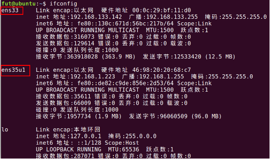
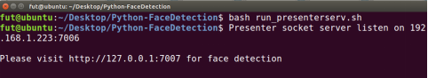
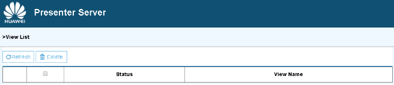
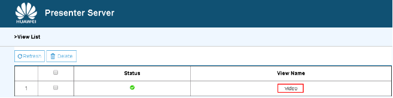

中文|[英文](README.md)

开发者可以将本application部署至Atlas 200DK上实现对摄像头数据的实时采集、并对视频中的人脸信息进行预测的功能。

注意：下文中UIHost指PC端安装Ubuntu系统的服务器；Host指Altas200DK开发板；Device指Ascend310芯片

## 前提条件

部署此Sample前，需要准备好以下环境：

-   保证开发版的系统版本为887及其以上，连接好相机，并连接在开发板CAMERA0上;    
-   通过Ubuntu服务器ssh登录开发板;   
-   开发板完成相关Python环境和系统必要配置。

## 环境配置
-   获取源码

   	将https://gitee.com/Atlas200DK/sample-objectdetection-python.git   

   	仓中的代码下载至所在Ubuntu服务器（UIHost）的任意目录，例如代码存放路径为：$HOME/ascend/sample-	objectdetection-python。

-   安装环境依赖

    进入sample-	objectdetection-python/scrip目录，然后切换到root用户下，在终端执行
    
	bash install.sh <开发板ip地址> <外网ip> <内网ip> 
    
	开发板ip地址：  开发板网口地址。使用usb连接时默认为192.168.1.2, 使用网线连接时默认为192.168.0.2     
    外网ip：UIHost连接Internet的网口名     
    内网ip：UIHost上和开发板连接的网口名。在UIHost上使用ifconfig可以查看  
	
	install.sh脚本执行的操作有：
	
	1.安装presenterserver依赖的python包；    
	
	2.配置开发板和Ubuntu服务器网络，使开发板可以连接internet。Ubuntu服务器和开发板网络配置都需要在root账户下执行，所以在Ubuntu服务器上要切换到root账户执行install.sh脚本。并且在开发板侧install.sh脚本也会切换到root账户执行配置命令，切换时会提示用户输入开发板root账户密码，默认密码为"Mind@123"；   
	
	3.升级和更新开发板的linux系统。为了安装依赖的python包，install.sh脚本会自动在开发板上执行命令apt-get update和apt-get upgrade。根据网络以及开发板是否已经执行过更新等状况，该步骤的执行时间可能会超过20分钟，并且期间安装询问交互，选Y即可；
	
	4.安装模型推理python包hiai,以及依赖的python-dev、numpy、pip、esasy_install、enum34、funcsigs、future等python包。因为numpy采用编译安装的方式，编译时间较长，所以安装时间会超过10分钟。并且安装过程中会出现安装询问交互，输入Y即可。
	
	注意：安装环境依赖只需要在
	（1）第一次运行object Detection样例
	（2）采用全新制卡方式升级开发板后运行object Detection样例
	两种场景下执行。已经成功安装后不需要执行。
	  

## 部署    
        
-   步骤 1 在UIHost服务器上，进入sample-objectdetection-python的script目录，并切换到普通用户:

	然后执行如下命令完成部署：

	bash deploy.sh <开发板ip地址> <内网ip>  
   
	开发板ip地址：  开发板网口地址。使用usb连接时默认为192.168.1.2, 使用网线连接时默认为192.168.0.2          
        内网ip：UIHost上和开发板连接的网口名。在UIHost上使用ifconfig可以查看  
	  
	注意：部署操作是将object Detection样例代码拷贝到Atlas开发板。scp拷贝需要用户输入ssh登录密码，所以脚本执行过程中会提示输入密码，默认为Mind@123    
       
    
	示例：

	**图 1**  网口配置  
	
	
	例如：如[图1](#zh-cn_topic_0167071573_fig184321447181017)所示，假设自己的用户用户名为HwHiAiUser,开发板ip地址为192.168.1.2,则终端命令应该写成

        bash deploy.sh 192.168.1.2 192.168.1.223

	
-   步骤 2启动Presenter Server

	在部署脚本执行成功后，继续输入命令
	
	bash run_presenterserv.sh

	**图 2**  Presenter Server进程启动  
	  
	
	使用[图2](#zh-cn_topic_0167071573_fig184321447181018)提示的URL登录Presenter Server，仅支持Chrome浏览器。IP地址为图中输入的IP地址，端口号默为7007，如图3  所示，表示Presenter Server启动成功。    
	
	**图 3**  Presenter Server页面  
	  	

## 运行
-   步骤 1 运行sample-objectdetection-python程序。
       在UIHost服务器上，进入sample-objectdetection-python的script目录，并切换到普通用户,执行如下命令：
	
          bash run_objectdetectionapp.sh <用户名>@<host_ip>            
	 
       用户名：开发板的登录用户名，默认为HwHiAiUser   
       host_ip：开发板网口地址。采用usb网口连接时，默认地址是192.168.1.2； 网线连接时，默认地址是192.168.0.2    
       如果不输入用户名和host_ip参数，命令脚本默认采用 HwHiAiUser@192.168.1.2    
        
-   步骤 2 登录 Presenter Server web页面。地址为启动Presenter Server服务时提示的URL，详细可参考部署的步骤[2](#zh-cn_topic_0167071573_fig184321447181030)。    
	等待Presenter Agent传输数据给服务端，单击“Refresh”刷新，当有数据时相应的Channel 的Status变成绿色，如图4所示。

	**图 4**  Presenter Sever运行  
      

	object Detection的Presenter Server最多支持10路Channel同时显示，每个 presenter_view_app_name 对应一路Channel。
	由于硬件的限制，每一路支持的最大帧率是20fps，受限于网络带宽的影响，帧率会自动适配为较低的帧率进行展示。
-   步骤 3 单击右侧对应的View Name链接，比如上图的“video”，查看结果，对于检测到的人脸，会给出置信度的标注。

## 后续处理

-   **停止object Detection应用**	
	
	执行object Detection运行脚本后， 应用会处于持续运行状态。若要停止应用程序，可以在UIHost端进入ample-objectdetection-python/script目录，切换到root用户
    
        cd sample-objectdetection-python/script/
        su root
	
	执行命令
        
        bash stop_objectdetectionapp.sh <用户名>@<ip> 
	
	用户名和ip参数参见运行节步骤[1](#zh-cn_topic_0167071573_fig184321447181032)，如果不输入参数 默认为HwHiAiUser@192.168.1.2

-   **停止Presenter Server服务**

       object Detection的Presenter Server启动后会处于持续运行状态。若要停止Presenter Server应用程序，可以在UIHost端进入sample-objectdetection-python/script目录下，切换到root用户
	  	  
         cd sample-objectdetection-python/script/    
         su root
  
       执行终端命令
    
         bash stop_presenterserver.sh   
